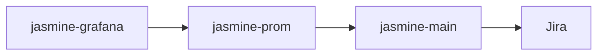

# jasmine
JASMINE stands for Jira Assisted Streamlined Metrics with Insightful Naming 
Extraction. The personal project was created to provide better graphing
options than what Jira Cloud was providing out of box. It was also a 
learning experience on the Jira API, Golang, Prometheus, and Grafana.

## Container Deployment Overview
Three containers are spun up with `docker-compose`:

<dl>
  <dt>jasmine-main</dt>
  <dd>The application itself.</dd>
  <dt>jasmine-prom</dt>
  <dd>Prometheus deployment configured to scrape the application's /metrics endpoint.</dd>
  <dt>jasmine-grafana</dt>
  <dd>Grafana deployment configured to use Prometheus as a data source.</dd>
</dl>

Grafana is configured to use Prometheus as a data source. Prometheus is configured to scrape the Jasmine application. Jasmine is configured to query Jira on an interval.

## More to Come!
Stay tuned.

## References

1. https://github.com/golang-standards/project-layout